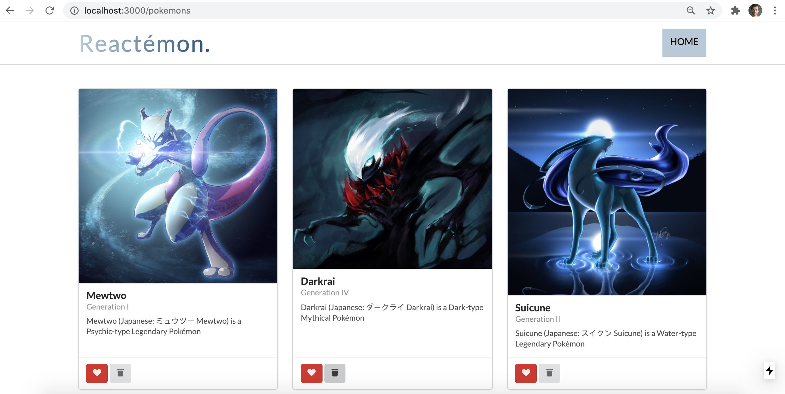

## About

Simple pokemon display app w/ React (Next.js) + Semantic UI + SASS + ~~AWS Lambdas (w/ AWS DynamoDB)~~

API endpoints of AWS Lambda in `./constants.js` are removed for security purposes

## Scripts

`npm run dev` to run in dev mode

`npm run build` followed by `npm start` to run in prod mode

## Showcase

  /pokemons

  

